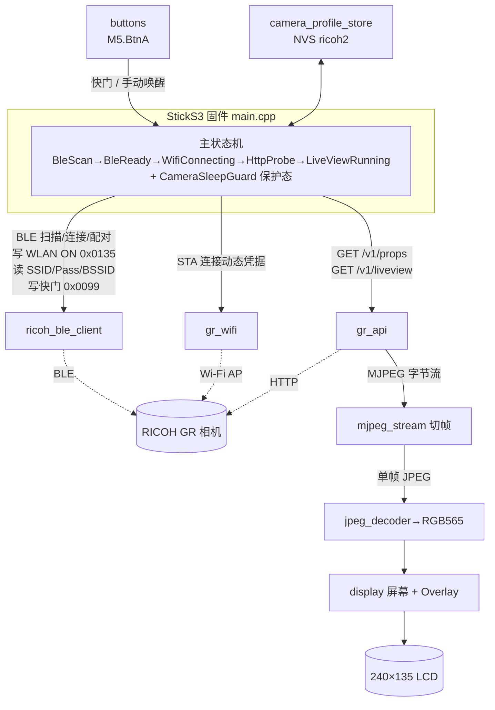

# CLAUDE.md — RICOH GR Live View Shooting

> 项目 AI 上下文索引（根级简明）。模块级详尽文档见 [`src/CLAUDE.md`](src/CLAUDE.md)。
>
> 生成时间：2026-06-29 17:19:32 CST ｜ 工具：`/ccg:init`

## 一句话概述

M5Stack StickS3（ESP32-S3）固件：以 **BLE 为唯一在线入口**识别并连接 RICOH GR 相机，经 BLE 临时唤醒相机 Wi-Fi 并读取动态 Wi-Fi 凭据，再通过 HTTP LiveView 在屏幕上显示实时 MJPEG 预览，并支持遥控快门。

## 技术栈

| 维度 | 内容 |
| --- | --- |
| 平台 | PlatformIO（`platformio.ini`），`platform=espressif32@6.12.0`，`framework=arduino` |
| 目标板 | M5Stack StickS3（ESP32-S3-PICO-1-N8R8，8MB Flash / 8MB PSRAM），`board=esp32-s3-devkitc-1` |
| 屏幕 | 240×135，经 M5Unified / LovyanGFX 渲染 |
| 关键库 | `M5Unified`、`M5PM1`、`bitbank2/JPEGDEC@^1.8.2`、`bblanchon/ArduinoJson@^7.0.0`、`h2zero/NimBLE-Arduino@2.5.0` |
| 语言 | C++（Arduino 风格，`.cpp` + `.h` 扁平放在 `src/`） |
| 许可证 | GPL-3.0 |

## 构建 / 烧录 / 监控

```bash
platformio run                 # 编译
platformio run -t upload       # 烧录（upload_speed=921600）
platformio device monitor      # 串口日志（monitor_speed=115200）
platformio test -e native      # host-side 纯逻辑单元测试
```

已有 host-side native 单元测试覆盖 `MjpegStream` 纯逻辑边界与相机身份名称推导；完整链路验证仍依赖真实硬件（StickS3 + RICOH GR III/IIIx/IV）与串口日志。

## 模块导航

> ⚠️ **本节已过时（2026-07-09 起）**：`src/` 已从纯扁平结构演进为分层结构，新增了 `src/app/`、`src/board/`、`src/core/`、`src/drivers/`、`src/services/`、`src/supervisor/`、`src/ui/` 等目录（新旧模块目前同时存在，`main.cpp` 两套都在 include）。下表仍是旧的扁平模块列表，仅供参考旧文件的职责，不代表当前完整结构。完整、已核对的文件清单和新旧模块对应关系见 [`docs/project_overview.md`](docs/project_overview.md)「功能模块」一节。同时，本节提到的主状态机（`BleScan → BleReady → WifiConnecting → HttpProbe → LiveViewRunning` + `CameraSleepGuard`）也已重构，见下方「核心状态机」旁注和 `docs/project_overview.md`。

代码原先全部扁平放在 `src/`（共 10 个 `.cpp`/`.h` 对 + `config.h`，约 3711 行）。按职责分层（旧结构）：

| 层 | 文件 | 职责 |
| --- | --- | --- |
| 编排 | [`src/main.cpp`](src/main.cpp) | 主状态机、连接流程、相机关机保护态、按键分发、`loop()` |
| BLE | [`src/ricoh_ble_client.*`](src/ricoh_ble_client.h) | RICOH BLE 扫描/连接/配对、Wi-Fi 凭据读取、快门写入、电源状态通知 |
| Wi-Fi | [`src/gr_wifi.*`](src/gr_wifi.h) | ESP32 STA 连接相机 AP（支持 BSSID 锚定 + 连接守卫回调） |
| HTTP API | [`src/gr_api.*`](src/gr_api.h) | RICOH HTTP：`GET /v1/props`、`GET /v1/liveview`（MJPEG 流读取） |
| 相机身份 | [`src/camera_identity.*`](src/camera_identity.h) | 从 RICOH Wi-Fi SSID 推导候选 BLE 名称 |
| 解码渲染 | [`src/mjpeg_stream.*`](src/mjpeg_stream.h) · [`src/jpeg_decoder.*`](src/jpeg_decoder.h) · [`src/display.*`](src/display.h) | MJPEG 帧切分 → JPEG 解码到 RGB565 → 屏幕 UI/Overlay |
| 持久化 | [`src/camera_profile_store.*`](src/camera_profile_store.h) | NVS（namespace `ricoh2`）存储相机 BLE 身份、Wi-Fi 缓存与 IP |
| 输入 | [`src/buttons.*`](src/buttons.h) | 仅轮询 `M5.BtnA` |
| 配置 | [`src/config.h`](src/config.h) | 全局常量：BLE GATT 句柄、超时、扫描次数、缩放策略、Service UUID |

详细接口、依赖、状态机说明见 [`src/CLAUDE.md`](src/CLAUDE.md)。

## 架构图



## 核心状态机

> ⚠️ **本节已过时**：`CameraFlowState` 现在只是 `rvf::AppState`（定义于 `src/app/AppState.h`）的类型别名，成员已从 6 个扩展到 21 个（新增 `Booting`、`Idle`、`ScanningCamera`、`ConnectingBle`、`CheckingCameraPower`、`CameraPowerOff`、`ActivatingWifi`、`ConnectingWifi`、`HttpProbing`、`PreviewStarting`、`PreviewRunning`、`PreviewStopped`、`Shooting`、`Disconnected`、`Error` 等）。实际代码中的关机保护态用的是 `CameraPowerOff`，而非下面提到的 `CameraSleepGuard`（`CameraSleepGuard` 仍在枚举里但未见被实际赋值，疑似遗留）。详见 [`docs/project_overview.md`](docs/project_overview.md) 和 [`docs/ricoh_ble_protocol.md`](docs/ricoh_ble_protocol.md)。下面这段按旧命名描述整体流程，语义仍大致成立，仅命名对不上新代码。

`main.cpp` 的 `CameraFlowState`：`BleScan → BleReady → WifiConnecting → HttpProbe → LiveViewRunning`，外加保护态 `CameraSleepGuard`（现为 `CameraPowerOff`，见上方警告）。

- 收到相机主动断连（reason `0x213`/`0x215`）或 BLE 电源通知 `0x00` → 进入 `CameraSleepGuard`，15s 冷却期内禁止扫描/重连/Wi-Fi ON，冷却后**仍不自动唤醒**，须用户按键。
- `loop()` 周期：`handleButtons → serviceCameraFlowIfNeeded → ensureWiFi → refreshPropsIfDue → ensureLiveView → updateStatusUiIfDue`。
- LiveView 卡顿看门狗：`LIVEVIEW_STALL_TIMEOUT_MS`（5s）无有效帧即触发恢复。

## 关键约定（改代码前必读）

1. **Wi-Fi 凭据动态获取** —— 不再硬编码 SSID/密码；`platformio.ini` 无需 `GR_WIFI_SSID/PASSWORD`，凭据由 BLE 实时读取写入 `CameraProfile.wifi`。
2. **BLE GATT 句柄在 `config.h`** —— 已用 RICOH GR Android App HCI 抓包验证（2026-06-27/28），修改前先看注释。电源状态句柄 `0x00EB`/CCCD `0x00EC`、WLAN `0x0135`、快门 `0x0099`。
3. **电源门控** —— 开 Wi-Fi 前必须 `readPowerState()` 确认相机 `On`；`RICOH_BLE_REQUIRE_POWER_ON_BEFORE_WIFI=true`。手动唤醒走 `cameraManualWakeOverride` 旁路。
4. **帧缓冲在 PSRAM** —— `FRAME_BUFFER_SIZE=256KB`，优先 `MALLOC_CAP_SPIRAM`，回退内部 RAM；无 PSRAM 直接报错停机。
5. **JPEG 缩放** —— `config.h` 设 `JPEG_SCALE_POLICY=JPEG_SCALE_HALF`（覆盖 `display.h`/`jpeg_decoder.h` 的 `QUARTER` 默认），此为 `m5stack-sticks3` 基础环境的取值。`m5stack-sticks3-gr3x` 环境在 `platformio.ini` 的 `build_flags` 中进一步覆盖为 `JPEG_SCALE_QUARTER`（实测 GR IIIx 上约 9fps，对比 HALF 的约 4.6fps；解码器按 contain-fit 整帧显示，两侧留黑边，不裁切）。
6. **NVS schema** —— namespace `ricoh2`，`proto_ver`（当前 3）/`cam_name`/`ble_addr`/`ble_addr_type`/`ble_bonded`/`cam_ip`/Wi-Fi cache。保护态只在 RAM 中生效，StickS3 重启后会重新走自动连接流程。已保存 BLE 身份的 `setup()` 启动流只做一轮快速扫描，失败后交给主循环处理 KEY1 和周期重试。
7. **按键 = 仅 `M5.BtnA`** —— 见下方「按键实现说明」（原文写的是「文档漂移」小节，但本文件里从未存在同名标题，这里已改成实际标题名）。

## 按键实现说明

固件使用 StickS3 `M5.BtnA` 触发 BLE 快门/保护态手动唤醒，使用 `M5.BtnPWR`/M5PM1 处理长按关机。**无 GPIO11/G11 外接快门、无 `attachInterrupt`**（早期版本曾有 G11 外接快门，已在提交 `7160103 "simplify buttons"` 中移除；README 已于 2026-06-29 同步修正）。`display.cpp` UI 文案标注「BtnA: shutter / wake」「Press BtnA to reconnect」。`liveviewEnabled` 无按键切换路径，仅被手动唤醒重置为 `true`。

## 关键配置速查

| 参数 | 默认 | 位置 | 说明 |
| --- | ---: | --- | --- |
| `BLE_SCAN_SECONDS` | 2 | config.h | 单轮 BLE 扫描时长 |
| `BLE_FAST_CONNECT_TIMEOUT_MS` | 3000 | config.h | 已保存 BLE 地址/地址类型时的 direct reconnect 超时 |
| `BLE_CONNECT_ATTEMPTS` | 12 | config.h | 有身份时重连尝试次数 |
| `RICOH_BLE_BONDED_SECURITY_WAIT_MS` | 1500 | config.h | 已 bonded 相机重连时的加密恢复等待 |
| `FIRST_BOOT_BLE_PAIRING_ATTEMPTS` | 12 | config.h | 无 NVS 身份时配对扫描次数 |
| `CAMERA_POWER_OFF_COOLDOWN_MS` | 15000 | config.h | 关机断连冷却 |
| `BLE_MANUAL_WAKE_REINIT_SETTLE_MS` | 3000 | config.h | 手动唤醒 BLE 栈重建等待 |
| `LIVEVIEW_STALL_TIMEOUT_MS` | 5000 | config.h | LiveView 卡顿恢复阈值 |
| `WIFI_CONNECT_TIMEOUT_MS` | 15000 | config.h | Wi-Fi 连接超时 |
| `FRAME_BUFFER_SIZE` | 256KB | config.h | JPEG 帧缓冲（PSRAM） |
| `GR_HOST` | 192.168.0.1 | config.h | 相机默认 IP（可被 NVS `cam_ip` 覆盖） |
