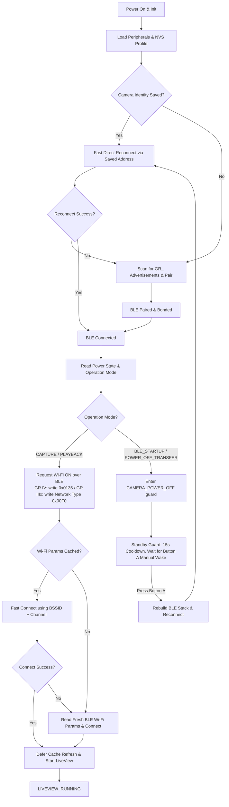

<p align="center">
  <a href="./README_ZH.md">
    
  </a>
  <a href="./README.md">
    
  </a>
</p>

<h1 align="center">RICOH GR Live View Shooting</h1>

<p align="center">
  A wireless live-view shooting and BLE remote shutter firmware running on the M5Stack StickS3 for RICOH GR cameras.
</p>

<p align="center">
  The firmware uses <strong>BLE as the entry point for camera discovery, pairing, wake control, and shutter control</strong>. It dynamically obtains Wi-Fi credentials over BLE and requests MJPEG live-view streams via HTTP API to render preview frames smoothly on the StickS3.
</p>

> [!NOTE]
> Looking for details on the communication protocol or state machine? Read [docs/project_overview.md](docs/project_overview.md) for the architecture overview, and [docs/ricoh_ble_protocol.md](docs/ricoh_ble_protocol.md) for detailed BLE characteristics and handles.

> [!NOTE]
> **Project Development Note**: The author of this repository does not have an embedded development background. All firmware code, system architecture design, and documentation in this repository were entirely developed and structured in collaboration with AI assistants (Codex and Claude Code). Please excuse any code design issues or inefficiencies. You are highly welcome to open [Issues](https://github.com/ndreij/RICOH-GR-Live-View-Shooting/issues) or submit Pull Requests for discussion and improvement!

---

## What Ships (Core Capabilities)

* **High-framerate LiveView Rendering**: A dedicated MJPEG stream parser backed by ESP32-S3 hardware JPEG decoding directly onto LovyanGFX / M5Canvas, minimizing display latency.
* **Restructured Layered Architecture**: Transitioned from a single-file codebase to a clean Supervisor-Controller-Service pattern, significantly improving reliability and maintenance.
* **Camera Standby & Wake Guard**: Queries the camera's `Power State` and `Operation Mode` before enabling Wi-Fi to prevent waking up a camera that is explicitly powered down or in standby.
* **WLAN Parameter Caching**: Caches SSID, BSSID, channel, and encryption details in ESP32 NVS. Subsequent boots achieve ultra-fast connections in `<0.5s` by skipping BLE renegotiation.
* **Physical Button AF Shutter**: Fully implements the official RICOH BLE Shooting Service protocol, using Button A to trigger high-precision auto-focus (AF) and instant capture.
* **One-Hold BLE Reset**: Hold either the front button (Button A) or the side button (Button B) for 3s to clear stored BLE pairing and bonding data, allowing quick pairing with a new camera.
* **GR IIIx Support (Experimental)**: The RICOH GR IIIx pairs via on-device passkey entry and runs the full Wi-Fi LiveView flow plus BLE remote shutter (AF + capture). Build with `-e m5stack-sticks3-gr3x`. See [RICOH GR IIIx Support](#ricoh-gr-iiix-support-experimental).
* **Host-side Native Test Suite**: Allows compiling and running data parser and state transition tests directly on your host machine without hardware.


---

## Quick Start

### 1. Build and Flash the Firmware
Connect the M5Stack StickS3 to your PC using a USB cable. Ensure PlatformIO Core is installed, then run:
```bash
# Build and upload the firmware
platformio run --target upload

# Optionally, specify the upload port if automatic detection fails
platformio run --target upload --upload-port COM6
```

### 2. First-time Scan and Pairing
1. Turn on your RICOH GR camera, and enable **Bluetooth** in the settings menu.
2. Power on the StickS3. The screen will display scanning status. It automatically looks for BLE advertisements starting with `GR_`.
3. Once found, the StickS3 initiates secure pairing (Bonding) and persists the bonded identity in NVS.

### 3. Automatic LiveView Startup
1. After pairing completes, the StickS3 requests Wi-Fi ON and reads the dynamically generated passphrase and BSSID over BLE.
2. The StickS3 joins the camera's Wi-Fi Access Point.
3. Once connected, it initiates a stream from `/v1/liveview` and starts displaying the camera view on the LCD screen.

---

## Controls

You can control the viewfinder's behavior using the buttons (Button A, Button B, and Power button) on the StickS3:

| Physical Button | App State / Context | Triggered Action |
| :--- | :--- | :--- |
| **Button A** (short tap) | During LiveView (`LIVEVIEW_RUNNING`) | Triggers BLE Auto-Focus (AF) and shoots (writes `ShootingFlavor=IMMEDIATE`). The tap fires on release so it can be told apart from the 3s pairing hold below. |
| **Button A** (short tap) | Standby / Camera Off (`CAMERA_POWER_OFF`) | Manually overrides the guard, resets the BLE stack, and attempts to wake/reconnect |
| **Button A** or **Button B** (Hold for 3s) | Any State | Triggers BLE pairing reset: clears stored BLE pairing/bonding information, terminates active Wi-Fi/BLE connections, and restarts scanning for a new camera. The camera-off screen shows a **HOLD 3S TO PAIR** hint for this. |
| **Power Button (BtnPWR)** | Any State (Long Press) | Gracefully terminates Wi-Fi/BLE connections, closes LiveView, and powers off the StickS3 |


---

## Core Architecture & Flow

### 1. Software Architecture Layout
The codebase has been refactored into distinct layers communicating via asynchronous events:
* **[SystemSupervisor](src/supervisor/SystemSupervisor.h)**: A health monitor running as a background task. It detects stalled Wi-Fi / HTTP LiveView streams and schedules recovery actions.
* **[AppController](src/app/AppController.h)**: The central business logic state machine, coordinating connections, power guards, manual wake overrides, and event dispatch.
* **[BleCameraService](src/services/BleCameraService.h)**: Encapsulates BLE tasks, such as scanning, bonding, querying power/shutter services, and writing shutter commands.
* **[WifiPreviewService](src/services/WifiPreviewService.h)**: Manages Wi-Fi STA connections and reads the HTTP MJPEG stream.

### 2. State Transition Flow
The diagram below details the application's connection and fallback paths from boot to live preview:



> Note: the GR IIIx has no equivalent of the GR IV's `0x0135` WLAN-power handle — it uses a completely different **Network Type** characteristic (`0x00F0`) to switch into Wi-Fi AP mode. See [RICOH GR IIIx Support](#ricoh-gr-iiix-support-experimental) below and [docs/ricoh_ble_protocol.md](docs/ricoh_ble_protocol.md) for the full handle table.

### 3. Camera Power-off and Sleep Protection (Standby Guard)
When the camera turns off (due to auto power-off or manual shutdown), or when the StickS3 boots and finds the camera in BLE standby (`BLE_STARTUP`):
1. The StickS3 immediately tears down its Wi-Fi and BLE connections to save camera power.
2. The state machine transitions to `CAMERA_POWER_OFF` and starts a **15-second safety cooldown**.
3. During this cooldown and subsequent standby phase, **automatic wake requests are completely blocked**. The camera remains in standby until the user presses Button A to wake it intentionally.

> `CameraSleepGuard` still exists as an enum value in `src/app/AppState.h`, but the code never actually assigns it — the guard state that's really used at runtime is `CameraPowerOff` (printed as `CAMERA_POWER_OFF` in the flow log below).

---

## Key Configuration

Customize these constants in [src/config.h](src/config.h) or `platformio.ini` to adjust timing:

| Parameter | Default Value | Description |
| :--- | :---: | :--- |
| `BLE_SCAN_SECONDS` | `2` | Duration of each Bluetooth scan cycle (seconds) |
| `BLE_FAST_CONNECT_TIMEOUT_MS` | `3000` | Timeout when reconnecting directly to a cached BLE address (ms) |
| `BLE_CONNECT_TIMEOUT_MS` | `8000` | Timeout when establishing a scanned BLE connection (ms) |
| `BLE_CONNECT_ATTEMPTS` | `12` | Maximum connection cycles when a cached identity exists |
| `RICOH_BLE_BONDED_SECURITY_WAIT_MS` | `1500` | Post-connect wait time for BLE security/encryption to settle (ms) |
| `RICOH_BLE_SECURITY_WAIT_MS` | `45000` | Max timeout for first-time security bonding to complete (ms) — long because GR IIIx on-device passkey entry can take a while |
| `RICOH_BLE_POWER_NOTIFY_SETTLE_MS` | `30` | Short settle window after enabling power notifications, used to catch immediate power-off notifications before Wi-Fi ON |
| `WIFI_CACHED_CONNECT_GRACE_MS` | `700` | Warm-up delay after requesting Wi-Fi ON before trying cached credentials |
| `WIFI_CACHED_CONNECT_TIMEOUT_MS` | `1200` | Aggressive connection timeout for cached BSSID + Channel (ms) |
| `WIFI_CONNECT_TIMEOUT_MS` | `15000` | Overall connection timeout limit for Wi-Fi STA |
| `CAMERA_POWER_OFF_COOLDOWN_MS` | `15000` | Mandatory cooldown block duration after camera power-off is detected |

---

## Camera Compatibility

> [!WARNING]
> The current code and protocol parameters have been verified on real hardware for **RICOH GR IV HDF** and **RICOH GR IIIx** only. Other models in the table below are untested extrapolations.

| Camera Series | Status | Compatibility Notes |
| :--- | :---: | :--- |
| **RICOH GR IV HDF** | **Verified Working** | Core development target. Supports BLE shutter and LiveView out of the box. |
| **RICOH GR IV Series** | **Expected to Work** | Shares the same BLE/Wi-Fi/HTTP API generation. Untested but expected to be compatible. |
| **RICOH GR IIIx** | **LiveView + Shutter** | Pairs via on-device passkey entry; runs full Wi-Fi LiveView plus BLE remote shutter (AF + capture), verified on real hardware (2026-07-08). Build with `-e m5stack-sticks3-gr3x`. See [RICOH GR IIIx Support](#ricoh-gr-iiix-support-experimental). |
| **RICOH GR III** | **Untested** | Same BLE generation as the GR IIIx; the GR IIIx build is expected to work but is unverified. |
| **RICOH GR II** | **Not Supported** | Lacks the BLE-first broadcast wake-up and on-demand Wi-Fi AP control interfaces. |

---

## RICOH GR IIIx Support (Experimental)

The GR IIIx runs the **full Wi-Fi LiveView flow** — screen preview plus BLE remote shutter — verified on real hardware on 2026-07-08 (shutter firing during preview). The `m5stack-sticks3-gr3x` build environment defaults to **quarter-scale** JPEG decoding (`JPEG_SCALE_QUARTER`), measured at roughly **9 fps** on real hardware (vs. ~4.6 fps at half-scale). The decoder renders the quarter-scale frame at its full original 4:3 aspect ratio (contain-fit), leaving thin black bars on the 16:9 screen rather than cropping any of the image. This ~9 fps is a hardware ceiling, not a decode/render limit: the firmware renders every frame the camera sends (0 dropped) with ~50 ms of CPU headroom per frame, and inbound frame cadence is bounded by the ~100 ms WiFi modem-sleep beacon interval that BLE + Wi-Fi coexistence on the ESP32-S3's single radio requires. Disabling modem sleep aborts the Wi-Fi stack (verified 2026-07-10), so it can't be raised without dropping the BLE shutter/power link.

**How Wi-Fi is enabled:** the GR IIIx exposes a completely different GATT layout from the GR IV. It has none of the GR IV's `0x0135`-range WLAN characteristics; instead its WLAN service (`F37F568F-...`) exposes a **Network Type** characteristic (`9111CDD0-...`, handle `0x00F0`). Writing `0x01` to it switches the camera into Wi-Fi AP mode. The SSID (`0x00F3`) and passphrase (`0x00F5`) are static read/write values, read over BLE and used to bring up the STA link — the same MJPEG LiveView path as the GR IV from there. The shutter path is UUID-based and works in parallel.

### Build

```bash
platformio run -e m5stack-sticks3-gr3x -t upload
```

This enables `-DCAMERA_MODEL_GR3X`, which selects the GR IIIx GATT handles and runs the full LiveView flow. To build a pure BLE remote shutter instead (no Wi-Fi/LiveView — lower power, faster connect), use `-e m5stack-sticks3-gr3x-shutter`, which stays in `BLE_READY`.

### On-device passkey pairing

Unlike the GR IV, the GR IIIx requires an authenticated (MITM) BLE pairing. On each attempt the camera shows a random 6-digit passkey on its screen, and you enter it on the StickS3:

| Action | Button |
| :--- | :--- |
| Increment the highlighted digit (0→9) | Press **Button A** |
| Move to the next digit | **Hold Button A** (~0.6s) |
| Submit the code | Advance past the last digit |

Once bonded, later reconnects are passwordless and take ~350ms.

### Shutter

| Action | Button |
| :--- | :--- |
| Auto-focus + capture | **Button A** (works during LiveView and in shutter-only mode) |

---

## Project Structure

> The codebase is mid-refactor: it is transitioning from a flat single-directory layout to a layered one. `src/main.cpp` currently `#include`s **both** the old flat headers and the new layered ones, so the flat files below are not dead code yet — treat both lists as live until the refactor finishes.

**New layered modules:**

* [platformio.ini](platformio.ini) — PlatformIO configuration and dependency mapping
* [src/main.cpp](src/main.cpp) — Entry point, setup initialization, and `loop()` (now just calls `runAppTick()`)
* [src/app/](src/app/) — Application state and control flow
  * [AppController.cpp](src/app/AppController.cpp) / [AppController.h](src/app/AppController.h) — State machine coordinator (`appStateName()`, `transitionTo()`, the `Flow: A -> B (reason) uptime=...` log line)
  * [AppState.h](src/app/AppState.h) — `rvf::AppState` enum (21 members) — `CameraFlowState` in `main.cpp` is a type alias for this
  * [AppFlowActions.h](src/app/AppFlowActions.h) — Action maps for flow transitions
* [src/board/](src/board/) — Board-level pin/config definitions ([BoardConfig.cpp](src/board/BoardConfig.cpp)/[.h](src/board/BoardConfig.h), [StickS3Pins.h](src/board/StickS3Pins.h))
* [src/core/](src/core/) — Shared infrastructure: [AppConfig](src/core/AppConfig.cpp), [AppEvent.h](src/core/AppEvent.h), [AppMessage.h](src/core/AppMessage.h), [Logger](src/core/Logger.cpp), [PeriodicTask.h](src/core/PeriodicTask.h), [Result.h](src/core/Result.h)
* [src/drivers/](src/drivers/) — Hardware drivers: [ButtonDriver](src/drivers/ButtonDriver.cpp), [DisplayDriver](src/drivers/DisplayDriver.cpp)
* [src/supervisor/](src/supervisor/) — Runtime health watchdog
  * [SystemSupervisor.cpp](src/supervisor/SystemSupervisor.cpp) / [SystemSupervisor.h](src/supervisor/SystemSupervisor.h) — Monitors stream health and triggers resets on stall
* [src/services/](src/services/) — Protocol and stream transport layers
  * [BleCameraService.cpp](src/services/BleCameraService.cpp) / [BleCameraService.h](src/services/BleCameraService.h) — NimBLE client, queries modes/shutter characteristics
  * [WifiPreviewService.cpp](src/services/WifiPreviewService.cpp) / [WifiPreviewService.h](src/services/WifiPreviewService.h) — Wi-Fi link management and LiveView downloader
  * [PreviewFrameBuffer.cpp](src/services/PreviewFrameBuffer.cpp) / [PreviewFrameBuffer.h](src/services/PreviewFrameBuffer.h) — Circular double-buffered frame manager to reduce fragmentation and delay
  * [CameraPowerPolicy.cpp](src/services/CameraPowerPolicy.cpp) / [CameraService.cpp](src/services/CameraService.cpp) — Camera power-state gating and orchestration
  * [ShutterService.cpp](src/services/ShutterService.cpp) — Shutter trigger orchestration
* [src/ui/](src/ui/) — [UiManager](src/ui/UiManager.cpp) (screen rendering), [ButtonInput](src/ui/ButtonInput.cpp), [UserCommand.h](src/ui/UserCommand.h)

**Older flat modules (still in active use, not yet migrated):**

* [src/ricoh_ble_client.cpp](src/ricoh_ble_client.cpp) — RICOH BLE protocol: scanning, pairing, Wi-Fi credential reads, shutter writes, power notifications
* [src/gr_wifi.cpp](src/gr_wifi.cpp) — ESP32 STA connection to the camera's Wi-Fi AP
* [src/gr_api.cpp](src/gr_api.cpp) — HTTP `/v1/props` and `/v1/liveview` MJPEG transport
* [src/display.cpp](src/display.cpp) — Screen UI (boot/status/error/overlay)
* [src/buttons.cpp](src/buttons.cpp) — Polls `M5.BtnA`
* [src/camera_identity.cpp](src/camera_identity.cpp) — Derives candidate BLE names from the camera's Wi-Fi SSID
* [src/camera_profile_store.cpp](src/camera_profile_store.cpp) — Handles NVS profiles and Wi-Fi credential serialization
* [src/jpeg_decoder.cpp](src/jpeg_decoder.cpp) / [mjpeg_stream.cpp](src/mjpeg_stream.cpp) — Splits MJPEG streams and decodes JPEG frames using ESP32-S3 hardware acceleration
* [src/config.h](src/config.h) — Global constants and BLE GATT handles
* [test/test_native/](test/test_native/) — Local host-side unit tests verifying core logic and stream processing

---

## Troubleshooting & Logs

> Every `Flow:` line printed by the firmware follows `Flow: <from> -> <to> (<reason>) uptime=<ms>ms` (see `AppController::transitionTo()`). The examples below keep that exact format; state names are whatever `appStateName()` returns for the current `rvf::AppState` value — note that `CameraSleepGuard` is a defined enum value but is never actually assigned by the code, so the real guard state you'll see in logs is always `CAMERA_POWER_OFF`, not `CAMERA_SLEEP_GUARD`.

### 1. Normal Connect & Launch
```text
BLE: connected secure connect_ms=2800
Flow: BLE_SCAN -> BLE_READY (BLE connected) uptime=2801ms
Flow: BLE_READY -> CHECKING_CAMERA_POWER (WiFi open) uptime=2802ms
BLE: power handle=0x00EB read value=0x01
BLE: operation mode read value=0x00 state=CAPTURE
BLE: power notify enabled cccd=0x00EC
Flow: CHECKING_CAMERA_POWER -> ACTIVATING_WIFI (BLE WiFi ON) uptime=2830ms
BLE: Wi-Fi open requested (handle=0x0135 value=0x01)
BLE: Wi-Fi parameters received ssid='GR_H264456' bssid='F2:3E:05:26:45:56' freq=2412 channel=1 wait_ms=340
WiFi cache: waiting 700ms for camera AP before cached connect
WiFi cache: trying cached params ssid='GR_H264456' bssid='F2:3E:05:26:45:56' channel=1 short_timeout=1200ms
WiFi: connect completed in 450ms channel=1 status=CONNECTED
Flow: WIFI_CONNECTING -> LIVEVIEW_RUNNING (LiveView opened) uptime=4520ms
LiveView: connected
```
*(GR IIIx uses a different Wi-Fi-on characteristic — `handle=0x00F0` instead of `0x0135` — everything else in the sequence is shared.)*

### 2. Standby Intercept (Auto-wake Blocked)
```text
Flow: BLE_READY -> CHECKING_CAMERA_POWER (WiFi open) uptime=2802ms
BLE: power handle=0x00EB read value=0x01
BLE: operation mode read value=0x02 state=BLE_STARTUP
WiFi held: camera asleep (operation mode=BLE_STARTUP power=On); NOT sending WLAN-ON, waiting for user to power on + press BtnA source=WiFi open
Flow: CHECKING_CAMERA_POWER -> CAMERA_POWER_OFF (BLE operation mode standby) uptime=2845ms
BLE guard: remote disconnect reason=533; idle until user powers camera on + presses BtnA
```
*(The firmware shuts down connection elements, blocks automatic wake, and goes quiet — it never writes WLAN-ON to a camera it isn't sure is awake and in CAPTURE mode, since that would extend the lens on a camera that's actually off.)*

### 3. Camera Powered Off Mid-Session (Immediate Detection)
```text
Flow: LIVEVIEW_RUNNING -> BLE_SCAN (BLE lost) uptime=47990ms
BLE: disconnect reason=531 (0x213 RemoteUserTerminated)
BLE: reconnect refused by camera (reason=531 0x213) -> camera off, entering guard
BLE guard: remote disconnect reason=531; idle until user powers camera on + presses BtnA
Flow: BLE_SCAN -> CAMERA_POWER_OFF (reconnect refused -- camera off) uptime=48210ms
```
*(When the camera is switched off mid-session, its BLE layer reliably tears down the link with reason 531/533 within about 1.5 seconds. The firmware treats that as immediate proof the camera is off and enters the guard right away, showing "Camera off" instantly instead of letting a Wi-Fi attempt run to its full timeout (up to 15s) or flickering between "Connecting..." and "Camera off".)*

While idling in the guard, you'll also periodically see lines like these in the serial log — this is normal passive polling, not an error:
```text
AUTO: camera advertising AWAKE (bit=0x01) -> confirming via no-security probe
BLE PROBE: connect_ms=180 read_ms=25 total_ms=210 read_ok=1 mode=Other
AUTO: probe did not confirm CAPTURE (probed=1 mode=3) -- keep waiting
```
*(The camera's advertising power bit can keep reporting "awake" for a while after it's actually switched off, so the firmware runs a brief read-only no-security probe every few seconds to check the real Operation Mode. It requires 2 consecutive CAPTURE reads before trusting it and waking the full connect flow, which filters out transient noise right after power-off.)*

### 4. Watchdog Recovery on Stalled LiveView
```text
SystemSupervisor: checking preview health...
SystemSupervisor: liveview last frame time 5200 ms ago, threshold is 5000 ms
SystemSupervisor: liveview stall detected! Requesting system recovery.
Flow: LIVEVIEW_RUNNING -> BLE_READY (Resetting connections) uptime=91340ms
...
```

---

## License

This project is licensed under the [GNU General Public License v3.0 (GPL-3.0)](LICENSE). You are free to modify, use, and distribute this firmware, provided any modifications or derivative works are also open-sourced under the GPL-3.0.
