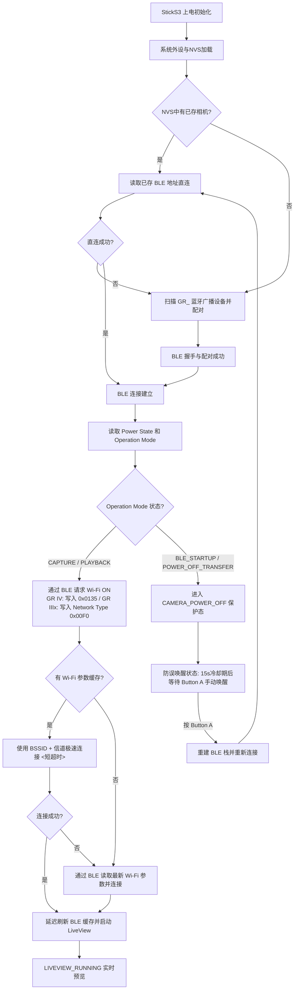

<p align="center">
  <a href="./README_ZH.md">
    
  </a>
  <a href="./README.md">
    
  </a>
</p>

<h1 align="center">RICOH GR Live View Shooting</h1>

<p align="center">
  运行在 M5Stack StickS3 上的理光 (RICOH) GR 远程实时取景器与 BLE 遥控快门固件。
</p>

<p align="center">
  固件以 <strong>BLE 作为相机发现、配对、唤醒和控制入口</strong>，动态获取 Wi-Fi 参数，通过 HTTP API 在 StickS3 上极速流畅渲染 MJPEG 实时取景画面并支持遥控快门。
</p>

> [!NOTE]
> 正在寻找硬件通信协议和状态机细节？请阅读 [docs/project_overview.md](docs/project_overview.md) 了解整体架构，以及 [docs/ricoh_ble_protocol.md](docs/ricoh_ble_protocol.md) 了解 BLE 协议详情。

> [!NOTE]
> **关于开发背景**：本项目作者本身不具备嵌入式开发能力，本仓库的全部固件代码、架构设计及相关文档均由 AI 助手（Codex 和 Claude Code）协作编写与整理。若您在代码设计、逻辑实现或稳定性上发现任何问题，敬请见谅。非常欢迎您提交 [Issues](https://github.com/ndreij/RICOH-GR-Live-View-Shooting/issues) 共同讨论或发起 Pull Request 予以完善！

---

## 核心交付内容 (What Ships)

* **高帧率 LiveView 渲染**：基于 ESP32-S3 硬件加速解码的 MJPEG 流处理器，直接输出到 LovyanGFX / M5Canvas，提供流畅的预览体验。
* **分层解耦架构**：重构了传统单文件嵌入式结构，引入了 Supervisor-Controller-Service 设计模式，大大提升了连接稳健度与可维护性。
* **智能休眠防误唤醒**：读取相机 `Power State` 和 `Operation Mode` 以确认真实运行状态，防止意外唤醒关机状态下的相机。
* **WLAN 动态参数缓存**：首次连接后，将相机的 Wi-Fi SSID、BSSID、信道及加密参数持久化写入 NVS，在下次启动时最快以 `<0.5s` 的极速完成直连。
* **物理按键 AF 遥控快门**：支持理光官方 BLE Shooting Service 协议，通过 Button A 进行高精度自动对焦与瞬间抓拍。
* **长按重置蓝牙配对**：长按前置按键 (Button A) 或侧边按键 (Button B) 3 秒，即可清除旧的蓝牙配对及绑定数据，方便快速切换并配对新相机。
* **GR IIIx 支持（实验性）**：理光 GR IIIx 通过在 StickS3 上输入机身屏幕显示的 6 位配对码完成配对，支持完整的 Wi-Fi LiveView 实时取景与 BLE 遥控快门（自动对焦 + 抓拍）。使用 `-e m5stack-sticks3-gr3x` 编译，详见下方 **RICOH GR IIIx 支持（实验性）** 章节。
* **完整 Native 测试套件**：无需依赖 StickS3 硬件，即可在 Host 端运行核心数据解析和状态转换的本地测试。

---

## 快速开始 (Quick Start)

### 1. 编译并烧录 StickS3 固件
将 M5Stack StickS3 通过 USB 连接至电脑，确保已安装 PlatformIO 环境，运行以下命令编译并烧录固件：
```bash
# 自动编译并烧录固件
platformio run --target upload

# 如有需要，可指定特定的串口（例如 COM6）
platformio run --target upload --upload-port COM6
```

### 2. 首次扫描与安全配对
1. 打开理光 GR 相机，并在菜单设置中启用 **蓝牙连接 (Bluetooth)**。
2. 将 StickS3 上电，屏幕将显示扫描状态。它会自动搜寻以 `GR_` 开头的理光相机 BLE 广播。
3. 发现设备后，StickS3 将与其发起安全绑定配对（Bonding），并将配对标识与相机物理地址存入 NVS。

### 3. Wi-Fi 连接与 LiveView 启动
1. 蓝牙建立配对后，StickS3 自动发送 Wi-Fi 开启指令，并通过 BLE 实时读取相机动态生成的 Wi-Fi 密码、信道等信息。
2. 随后 StickS3 自动加入相机的 Wi-Fi AP 局域网。
3. 连接成功后，固件从 `/v1/liveview` 拉取 MJPEG 预览流，并在屏幕上流畅渲染取景画面。

---

## 控制操作指南 (Controls)

您可以通过 StickS3 的按键（Button A、Button B、电源键）来控制固件的行为：

| 实体按键 | 状态场景 | 触发行为描述 |
| :--- | :--- | :--- |
| **Button A**（短按） | 实时预览中 (`LIVEVIEW_RUNNING`) | 触发 BLE 自动对焦 (AF) 并进行抓拍 (写入 `ShootingFlavor=IMMEDIATE`)。短按在松开时触发，以便与下方 3 秒配对长按区分 |
| **Button A**（短按） | 相机关闭 / 休眠状态 (`CAMERA_POWER_OFF`) | 手动清除 Guard 冷却，强行重建 BLE 连接栈并唤醒/重连相机 |
| **Button A** 或 **Button B**（长按 3 秒） | 任意状态下 | 触发蓝牙配对重置：清除本地蓝牙配对信息与绑定关系，断开当前 Wi-Fi/BLE 连接，并重新进入 BLE 扫描配对模式。相机关闭画面会显示 **HOLD 3S TO PAIR** 提示 |
| **电源键 (BtnPWR)** | 任意状态下 (长按) | 优雅断开 Wi-Fi 局域网与 BLE 连接，关闭 LiveView 取景，StickS3 关机 |


---

## 核心架构与流转逻辑 (Core Architecture & Flow)

### 1. 软件架构设计
本项目经过重构，实现了清晰的分层和异步事件通知机制：
* **[SystemSupervisor](src/supervisor/SystemSupervisor.h)**：健康监视器，运行独立的健康轮询任务，负责检测 Wi-Fi/LiveView 连接是否卡死或掉线，并向控制器发送恢复指令。
* **[AppController](src/app/AppController.h)**：核心业务状态机，统一控制连接生命周期、保护态流转、手动唤醒和全局事件分发。
* **[BleCameraService](src/services/BleCameraService.h)**：BLE 协议驱动层，处理扫描、安全配对绑定、电量状态/操作模式读取及快门触发。
* **[WifiPreviewService](src/services/WifiPreviewService.h)**：Wi-Fi 取景服务层，管理 Wi-Fi 状态切换与 HTTP MJPEG 预览数据流的读取。

### 2. 状态机流转流程
以下是系统的核心连接流转图，展示了从上电到 LiveView 运行的整个生命周期：



> 注意：GR IIIx 没有 GR IV 那个 `0x0135` WLAN 电源句柄的等价物——它使用完全不同的 **Network Type** 特征值（`0x00F0`）切换到 Wi-Fi AP 模式。详见下方 **RICOH GR IIIx 支持（实验性）** 章节，以及 [docs/ricoh_ble_protocol.md](docs/ricoh_ble_protocol.md) 中的完整句柄表。

### 3. 相机关机与休眠保护 (Standby Guard)
理光相机在被动关机（如超时关机或插拔电池）时，或者在 StickS3 上电发现相机处于 `BLE_STARTUP` 待机广播状态时，为了不打扰用户的正常拍摄：
1. 系统会立即主动切断 Wi-Fi 连接和 BLE 物理层，避免占用通道。
2. 自动状态机流转到 `CAMERA_POWER_OFF`，并开启 **15 秒安全冷却期**。
3. 在冷却期及后续静默状态中，**绝不会自动唤醒相机**，直到用户物理按下 StickS3 的 Button A 触发主动唤醒。

> `CameraSleepGuard` 仍然作为一个枚举值存在于 `src/app/AppState.h` 中，但代码从未真正赋值给它——运行时实际使用的保护态是 `CameraPowerOff`（在下方的日志中打印为 `CAMERA_POWER_OFF`）。

---

## 关键配置参数 (Configuration)

您可以通过修改 [src/config.h](src/config.h) 或 `platformio.ini` 来调整固件表现：

| 参数名称 | 默认值 | 作用与说明 |
| :--- | :---: | :--- |
| `BLE_SCAN_SECONDS` | `2` | 单轮蓝牙扫描寻找相机的时间 (秒) |
| `BLE_FAST_CONNECT_TIMEOUT_MS` | `3000` | 使用已保存的相机地址直连时的超时 (毫秒) |
| `BLE_CONNECT_TIMEOUT_MS` | `8000` | 扫描到设备后建立 BLE 连接的超时 (毫秒) |
| `BLE_CONNECT_ATTEMPTS` | `12` | 存在已配对身份时的最大直连尝试轮数 |
| `RICOH_BLE_BONDED_SECURITY_WAIT_MS` | `1500` | 已绑定设备建立连接后，等待安全加密完成的等待延时 |
| `RICOH_BLE_SECURITY_WAIT_MS` | `45000` | 首次配对时，等待安全加密完成的最大超时（较长，因为 GR IIIx 的机上配对码输入可能需要一些时间） |
| `RICOH_BLE_POWER_NOTIFY_SETTLE_MS` | `30` | 开启 Power Notify 后的短暂等待窗口，用于在 Wi-Fi ON 前捕获立即到来的关机通知 |
| `WIFI_CACHED_CONNECT_GRACE_MS` | `700` | 发出 Wi-Fi 开启请求后，进行缓存快速连接前的过渡等待 |
| `WIFI_CACHED_CONNECT_TIMEOUT_MS` | `1200` | 缓存 Wi-Fi 参数连接时的超短超时时间 (用于极速直连) |
| `WIFI_CONNECT_TIMEOUT_MS` | `15000` | Wi-Fi 连接建立的全局超时时间上限 |
| `CAMERA_POWER_OFF_COOLDOWN_MS` | `15000` | 进入相机关机保护后的安全冷却期时间 |

---

## 相机兼容性状态 (Camera Compatibility)

> [!WARNING]
> 本固件和协议参数目前仅在 **RICOH GR IV HDF** 和 **RICOH GR IIIx** 上完成了实机验证。下表中的其他机型均为未经实测的推断。

| 相机系列 | 兼容状态 | 兼容性说明 |
| :--- | :---: | :--- |
| **RICOH GR IV HDF** | **已验证可用** | 固件核心开发和实机测试靶机，提供最完美的支持。 |
| **RICOH GR IV 系列** | **理论可用** | 同代 BLE/Wi-Fi/HTTP 协议，未做代码硬编码限制，理论上完美兼容。 |
| **RICOH GR IIIx** | **LiveView + 快门** | 通过机身屏幕 6 位配对码在机上完成配对，支持完整 Wi-Fi LiveView 实时取景与 BLE 遥控快门（自动对焦 + 抓拍），已于 2026-07-08 实机验证。使用 `-e m5stack-sticks3-gr3x` 编译，详见下方 **RICOH GR IIIx 支持（实验性）** 章节。 |
| **RICOH GR III** | **未验证** | 与 GR IIIx 同代 BLE 协议，GR IIIx 的构建理论上可用，但尚未实机验证。 |
| **RICOH GR II** | **当前不可用** | 缺乏低功耗蓝牙 (BLE) 先行广播和按需激活 Wi-Fi AP 的交互链路。 |

---

## RICOH GR IIIx 支持（实验性）

理光 GR IIIx 现已支持 **完整的 Wi-Fi LiveView 实时取景**（屏幕预览 + BLE 遥控快门），并于 2026-07-08 在真实硬件上验证通过（预览过程中可触发快门）。`m5stack-sticks3-gr3x` 编译环境默认使用 **1/4 缩放**解码 JPEG（`JPEG_SCALE_QUARTER`），实机测得约 **9 fps**（1/2 缩放约 4.6 fps），解码器会将 1/4 缩放后的画面按原始 4:3 比例整帧显示，在 16:9 屏幕上下留出细黑边，不裁切画面内容。

**Wi-Fi 如何开启：** GR IIIx 的 GATT 布局与 GR IV 完全不同，没有 GR IV 的 `0x0135` 系列 WLAN 特征值；其 WLAN 服务（`F37F568F-...`）改为提供 **Network Type** 特征值（`9111CDD0-...`，句柄 `0x00F0`）。向其写入 `0x01` 即可将相机切换到 Wi-Fi 热点（AP）模式。SSID（`0x00F3`）与密码（`0x00F5`）为静态可读写值，经 BLE 读取后用于建立 STA 连接，此后即复用与 GR IV 相同的 MJPEG LiveView 链路。快门链路基于 UUID 实现，可并行工作。

### 编译

```bash
platformio run -e m5stack-sticks3-gr3x -t upload
```

该命令启用 `-DCAMERA_MODEL_GR3X`，选择 GR IIIx 的 GATT 句柄并运行完整的 LiveView 流程。若只想要纯 BLE 遥控快门（不启用 Wi-Fi/LiveView，功耗更低、连接更快），可改用 `-e m5stack-sticks3-gr3x-shutter`，固件将保持在 `BLE_READY`。

### 机上配对码输入

与 GR IV 不同，GR IIIx 需要经过身份认证（MITM）的 BLE 配对：每次配对时相机屏幕会显示一个随机 6 位配对码，需在 StickS3 上输入：

| 操作 | 按键 |
| :--- | :--- |
| 当前高亮位数字 +1（0→9） | 按 **Button A** |
| 移动到下一位 | **长按 Button A**（约 0.6 秒） |
| 提交配对码 | 越过最后一位即提交 |

配对绑定成功后，后续重连无需再次输入，约 350ms 完成。

### 快门

| 操作 | 按键 |
| :--- | :--- |
| 自动对焦 + 抓拍 | **Button A**（LiveView 及纯快门模式下均可用） |

---

## 项目源码结构 (Project Structure)

> 代码库正处于重构过程中：正从扁平的单目录结构过渡到分层结构。`src/main.cpp` 目前**同时** `#include` 旧的扁平头文件和新的分层头文件，因此下面的扁平文件目前还不是死代码——在重构完成前，两份列表都应视为在用代码。

**新增分层模块：**

* [platformio.ini](platformio.ini) — PlatformIO 环境配置文件与依赖项管理
* [src/main.cpp](src/main.cpp) — 硬件层及主循环初始化入口（`loop()` 现在只调用 `runAppTick()`）
* [src/app/](src/app/) — 状态机管理
  * [AppController.cpp](src/app/AppController.cpp) / [AppController.h](src/app/AppController.h) — 状态调度中控（`appStateName()`、`transitionTo()`、`Flow: A -> B (reason) uptime=...` 日志行的来源）
  * [AppState.h](src/app/AppState.h) — `rvf::AppState` 枚举（共 21 个成员）——`main.cpp` 中的 `CameraFlowState` 就是它的类型别名
  * [AppFlowActions.h](src/app/AppFlowActions.h) — 状态转换动作映射
* [src/board/](src/board/) — 板级引脚/配置定义（[BoardConfig.cpp](src/board/BoardConfig.cpp)/[.h](src/board/BoardConfig.h)、[StickS3Pins.h](src/board/StickS3Pins.h)）
* [src/core/](src/core/) — 共享基础设施：[AppConfig](src/core/AppConfig.cpp)、[AppEvent.h](src/core/AppEvent.h)、[AppMessage.h](src/core/AppMessage.h)、[Logger](src/core/Logger.cpp)、[PeriodicTask.h](src/core/PeriodicTask.h)、[Result.h](src/core/Result.h)
* [src/drivers/](src/drivers/) — 硬件驱动：[ButtonDriver](src/drivers/ButtonDriver.cpp)、[DisplayDriver](src/drivers/DisplayDriver.cpp)
* [src/supervisor/](src/supervisor/) — 运行健康监护
  * [SystemSupervisor.cpp](src/supervisor/SystemSupervisor.cpp) / [SystemSupervisor.h](src/supervisor/SystemSupervisor.h) — 监测任务运行状态并执行故障恢复
* [src/services/](src/services/) — 协议层与流传输层服务
  * [BleCameraService.cpp](src/services/BleCameraService.cpp) / [BleCameraService.h](src/services/BleCameraService.h) — NimBLE 蓝牙连接驱动与协议点读写
  * [WifiPreviewService.cpp](src/services/WifiPreviewService.cpp) / [WifiPreviewService.h](src/services/WifiPreviewService.h) — ESP32 STA 连接及 HTTP LiveView 接收驱动
  * [PreviewFrameBuffer.cpp](src/services/PreviewFrameBuffer.cpp) / [PreviewFrameBuffer.h](src/services/PreviewFrameBuffer.h) — 预览帧内存缓冲区管理，防止碎片化并优化渲染延迟
  * [CameraPowerPolicy.cpp](src/services/CameraPowerPolicy.cpp) / [CameraService.cpp](src/services/CameraService.cpp) — 相机电源状态门控与编排
  * [ShutterService.cpp](src/services/ShutterService.cpp) — 快门触发编排
* [src/ui/](src/ui/) — [UiManager](src/ui/UiManager.cpp)（屏幕渲染）、[ButtonInput](src/ui/ButtonInput.cpp)、[UserCommand.h](src/ui/UserCommand.h)

**旧的扁平模块（仍在实际使用，尚未迁移）：**

* [src/ricoh_ble_client.cpp](src/ricoh_ble_client.cpp) — RICOH BLE 协议：扫描/配对、Wi-Fi 凭据读取、快门写入、电源通知
* [src/gr_wifi.cpp](src/gr_wifi.cpp) — ESP32 STA 连接相机 Wi-Fi AP
* [src/gr_api.cpp](src/gr_api.cpp) — HTTP `/v1/props` 与 `/v1/liveview` MJPEG 传输
* [src/display.cpp](src/display.cpp) — 屏幕 UI（boot/status/error/overlay）
* [src/buttons.cpp](src/buttons.cpp) — 轮询 `M5.BtnA`
* [src/camera_identity.cpp](src/camera_identity.cpp) — 从相机 Wi-Fi SSID 推导候选 BLE 名称
* [src/camera_profile_store.cpp](src/camera_profile_store.cpp) — ESP32 NVS 相机配对及 AP 连接缓存序列化
* [src/jpeg_decoder.cpp](src/jpeg_decoder.cpp) / [mjpeg_stream.cpp](src/mjpeg_stream.cpp) — 高帧率 JPEG 硬件加速解码与字节边界切割
* [src/config.h](src/config.h) — 全局常量与 BLE GATT 句柄
* [test/test_native/](test/test_native/) — 运行在本地主机的架构与关键解析逻辑单元测试

---

## 故障排查与典型日志 (Troubleshooting)

> 固件打印的每一行 `Flow:` 日志都遵循 `Flow: <from> -> <to> (<reason>) uptime=<ms>ms` 格式（见 `AppController::transitionTo()`）。下面的示例都保留了这个精确格式；状态名就是当前 `rvf::AppState` 值经 `appStateName()` 转换后的结果——注意 `CameraSleepGuard` 是一个已定义但从未被代码实际赋值的枚举值，日志中真正会出现的保护态永远是 `CAMERA_POWER_OFF`，而不是 `CAMERA_SLEEP_GUARD`。

### 1. 正常开机直连并启动 LiveView
```text
BLE: connected secure connect_ms=2800
Flow: BLE_SCAN -> BLE_READY (BLE connected) uptime=2801ms
Flow: BLE_READY -> CHECKING_CAMERA_POWER (WiFi open) uptime=2802ms
BLE: power handle=0x00EB read value=0x01
BLE: operation mode read value=0x00 state=CAPTURE
BLE: power notify enabled cccd=0x00EC
Flow: CHECKING_CAMERA_POWER -> ACTIVATING_WIFI (BLE WiFi ON) uptime=2830ms
BLE: Wi-Fi open requested (handle=0x0135 value=0x01)
BLE: Wi-Fi parameters received ssid='GR_H264456' bssid='F2:3E:05:26:45:56' freq=2412 channel=1 wait_ms=340
WiFi cache: waiting 700ms for camera AP before cached connect
WiFi cache: trying cached params ssid='GR_H264456' bssid='F2:3E:05:26:45:56' channel=1 short_timeout=1200ms
WiFi: connect completed in 450ms channel=1 status=CONNECTED
Flow: WIFI_CONNECTING -> LIVEVIEW_RUNNING (LiveView opened) uptime=4520ms
LiveView: connected
```
*(GR IIIx 使用不同的 Wi-Fi 开启特征值——`handle=0x00F0` 而非 `0x0135`——序列中其余部分两者共用。)*

### 2. 相机处于待机状态 (防止意外唤醒)
```text
Flow: BLE_READY -> CHECKING_CAMERA_POWER (WiFi open) uptime=2802ms
BLE: power handle=0x00EB read value=0x01
BLE: operation mode read value=0x02 state=BLE_STARTUP
WiFi held: camera asleep (operation mode=BLE_STARTUP power=On); NOT sending WLAN-ON, waiting for user to power on + press BtnA source=WiFi open
Flow: CHECKING_CAMERA_POWER -> CAMERA_POWER_OFF (BLE operation mode standby) uptime=2845ms
BLE guard: remote disconnect reason=533; idle until user powers camera on + presses BtnA
```
*(此时固件自动断开并挂起，不唤醒相机——它永远不会向一台不确定是否清醒、是否处于 CAPTURE 模式的相机写入 WLAN-ON，因为那样可能会让一台其实已关机的相机伸出镜头。)*

### 3. 拍摄途中相机被关闭（立即识别，不再停留 "Connecting"）
```text
Flow: LIVEVIEW_RUNNING -> BLE_SCAN (BLE lost) uptime=47990ms
BLE: disconnect reason=531 (0x213 RemoteUserTerminated)
BLE: reconnect refused by camera (reason=531 0x213) -> camera off, entering guard
BLE guard: remote disconnect reason=531; idle until user powers camera on + presses BtnA
Flow: BLE_SCAN -> CAMERA_POWER_OFF (reconnect refused -- camera off) uptime=48210ms
```
*(相机在直播过程中被关闭时，其 BLE 层通常会在约 1.5 秒内以 reason=531/533 主动断开链路；固件据此立即进入保护态并显示 "Camera off"，不会再像早期版本那样把开 Wi-Fi 尝试跑到超时（最长 15 秒）或在 "Connecting..." / "Camera off" 之间反复跳动。)*

保护态期间，串口日志中还会周期性出现下面这类内容，属于正常的静默轮询，并非异常：
```text
AUTO: camera advertising AWAKE (bit=0x01) -> confirming via no-security probe
BLE PROBE: connect_ms=180 read_ms=25 total_ms=210 read_ok=1 mode=Other
AUTO: probe did not confirm CAPTURE (probed=1 mode=3) -- keep waiting
```
*(相机关机后，其广播中的电源位可能仍会显示"唤醒"一段时间，因此固件每隔几秒发起一次只读的 no-security 探测来确认相机真实的 Operation Mode；必须连续 2 次读到 CAPTURE 才会真正唤醒完整连接流程，避免刚关机时的瞬时噪声误触发重连。)*

### 4. 故障恢复：LiveView 无效帧卡死 (SystemSupervisor 自动介入)
```text
SystemSupervisor: checking preview health...
SystemSupervisor: liveview last frame time 5200 ms ago, threshold is 5000 ms
SystemSupervisor: liveview stall detected! Requesting system recovery.
Flow: LIVEVIEW_RUNNING -> BLE_READY (Resetting connections) uptime=91340ms
...
```

---

## 开源许可证 (License)

本项目采用 [GNU General Public License v3.0 (GPL-3.0)](LICENSE) 开源许可证。您可以自由修改、使用和二次发布本固件，但必须根据 GPL-3.0 要求对衍生工程开源。
